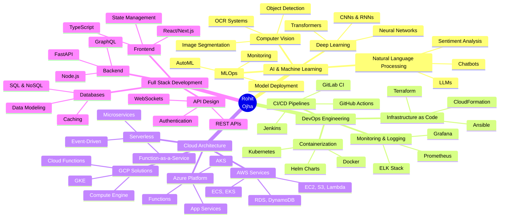

<!-- 
██████╗  ██████╗ ██╗  ██╗██╗████████╗     ██████╗      ██╗██╗  ██╗ █████╗ 
██╔══██╗██╔═══██╗██║  ██║██║╚══██╔══╝    ██╔═══██╗     ██║██║  ██║██╔══██╗
██████╔╝██║   ██║███████║██║   ██║       ██║   ██║     ██║███████║███████║
██╔══██╗██║   ██║██╔══██║██║   ██║       ██║   ██║██   ██║██╔══██║██╔══██║
██║  ██║╚██████╔╝██║  ██║██║   ██║       ╚██████╔╝╚█████╔╝██║  ██║██║  ██║
╚═╝  ╚═╝ ╚═════╝ ╚═╝  ╚═╝╚═╝   ╚═╝        ╚═════╝  ╚════╝ ╚═╝  ╚═╝╚═╝  ╚═╝
-->

<div align="center">
  


</div>

<p align="center">
  
</p>

<p align="center">
  
  
  
  
  
</p>

---


##  **About Me**

```javascript
class RohitOjha {
  constructor() {
    this.name = "Rohit Ojha";
    this.title = "Software Developer & DevOps Engineer";
    this.location = "Gurugram, India 🇮🇳";
    this.email = "monuoo1009@gmail.com";
  }

  get skills() {
    return {
      languages: ["Python", "TypeScript", "JavaScript", "C++", "Go"],
      ai_ml: ["TensorFlow", "PyTorch", "Scikit-learn", "OpenCV", "Keras"],
      devops: ["Docker", "Kubernetes", "Jenkins", "Terraform", "Ansible"],
      cloud: ["AWS", "Azure", "GCP", "Serverless", "CloudFormation"],
      backend: ["Node.js", "FastAPI", "Flask", "Django", "Express"],
      frontend: ["React", "Next.js", "Vue.js", "Tailwind CSS"],
      databases: ["PostgreSQL", "MongoDB", "MySQL", "Redis", "DynamoDB"],
      tools: ["Git", "Linux", "Nginx", "CI/CD", "Grafana", "Prometheus"]
    };
  }

  get currentFocus() {
    return [
      "🤖 Building AI-powered automation systems",
      "☁️ Architecting scalable cloud infrastructure",
      "🔄 Implementing advanced DevOps pipelines",
      "📊 Exploring MLOps and Model Deployment",
      "🌐 Contributing to Open Source projects"
    ];
  }

  get philosophy() {
    return "Code is poetry, automation is art! 🎨";
  }

  async collaborate() {
    console.log("Always open to innovative projects! 💡");
    console.log("Let's build something amazing together! 🚀");
  }
}

const me = new RohitOjha();
console.log(me.philosophy);
```

<br clear="right"/>

---

##  **Technology Arsenal**

<details open>
<summary><b>🔥 Click to Explore My Tech Stack</b></summary>
<br>

<div align="center">

### 💻 **Programming Languages**

<p>

</p>

<table>
<tr>
<td align="center" width="25%">

<br><b>Python</b>
</td>
<td align="center" width="25%">

<br><b>TypeScript</b>
</td>
<td align="center" width="25%">

<br><b>JavaScript</b>
</td>
<td align="center" width="25%">

<br><b>C++</b>
</td>
</tr>
</table>

### 🎨 **Frontend Development**

<p>

</p>

### ⚙️ **Backend & Frameworks**

<p>

</p>

### 🤖 **AI & Machine Learning**

<table>
<tr>
<td align="center" width="20%">

<br><b>TensorFlow</b>
</td>
<td align="center" width="20%">

<br><b>PyTorch</b>
</td>
<td align="center" width="20%">

<br><b>OpenCV</b>
</td>
<td align="center" width="20%">

<br><b>Pandas</b>
</td>
<td align="center" width="20%">

<br><b>NumPy</b>
</td>
</tr>
</table>

### ☁️ **DevOps & Cloud Technologies**

<p>

</p>

<table>
<tr>
<td align="center" width="20%">

<br><b>Docker</b>
</td>
<td align="center" width="20%">

<br><b>Kubernetes</b>
</td>
<td align="center" width="20%">

<br><b>Jenkins</b>
</td>
<td align="center" width="20%">

<br><b>Terraform</b>
</td>
<td align="center" width="20%">

<br><b>Ansible</b>
</td>
</tr>
</table>

### 🗄️ **Databases & Caching**

<p>

</p>

### 🛠️ **Tools & Platforms**

<p>

</p>

</div>

</details>

---

##  **GitHub Analytics**

<div align="center">


<br><br>


<br>


</div>

---

##  **Achievements & Trophies**

<div align="center">


<br>


</div>

---

##  **Contribution Snake**

<div align="center">

<picture>
  <source media="(prefers-color-scheme: dark)" srcset="https://raw.githubusercontent.com/Rohit544/Rohit544/output/github-contribution-grid-snake-dark.svg">
  <source media="(prefers-color-scheme: light)" srcset="https://raw.githubusercontent.com/Rohit544/Rohit544/output/github-contribution-grid-snake.svg">
  
</picture>

</div>

---

##  **Random Dev Wisdom**

<div align="center">


</div>

---

##  **Current Focus Areas**

<div align="center">



</div>

---

##  **Certifications & Learning**

<div align="center">

| 🏆 Certification | 🏢 Provider | 📅 Status | 🔗 Verify |
|:---:|:---:|:---:|:---:|
| **AWS Certified Solutions Architect** | Amazon Web Services | ✅ Active | [View](https://aws.amazon.com/certification/) |
| **Certified Kubernetes Administrator (CKA)** | CNCF | ✅ Active | [View](https://www.cncf.io/certification/cka/) |
| **Docker Certified Associate** | Docker Inc. | ✅ Active | [View](https://www.docker.com/certification/) |
| **TensorFlow Developer Certificate** | Google | ✅ Active | [View](https://www.tensorflow.org/certificate) |
| **Azure DevOps Engineer Expert** | Microsoft | 📚 In Progress | [View](https://learn.microsoft.com/certifications/) |
| **GCP Professional Cloud Architect** | Google Cloud | 📚 In Progress | [View](https://cloud.google.com/certification) |

</div>

---

##  **Coding Activity**

<div align="center">

<!--START_SECTION:waka-->

```text
💡 Editor Stats

VS Code                  85%  ████████████████████▓░░░░
Vim                      10%  ██▓░░░░░░░░░░░░░░░░░░░░░
Terminal                  5%  █▒░░░░░░░░░░░░░░░░░░░░░░

🔥 Languages This Week

TypeScript              12 hrs 45 mins  ████████████░░░░░░░░░  45.2%
Python                   8 hrs 30 mins  ████████░░░░░░░░░░░░░  30.1%
JavaScript               3 hrs 20 mins  ███░░░░░░░░░░░░░░░░░░  11.8%
YAML                     2 hrs 15 mins  ██░░░░░░░░░░░░░░░░░░░   8.0%
Markdown                 1 hr 25 mins   █░░░░░░░░░░░░░░░░░░░░   5.0%

🎯 Projects

AI Automation Tools      35%  ████████▓░░░░░░░░░░░░░░░░
DevOps Pipeline          28%  ███████░░░░░░░░░░░░░░░░░░
Cloud Infrastructure     22%  █████▓░░░░░░░░░░░░░░░░░░░
Open Source              15%  ███▓░░░░░░░░░░░░░░░░░░░░░
```

<!--END_SECTION:waka-->

</div>

---

##  **Featured Projects**

<div align="center">

<table>
<tr>
<td width="50%">

### 🤖 AI Chat Assistant


**An intelligent chatbot using GPT models**
- Natural Language Processing
- Context-aware responses
- Multi-language support

[View Project →](https://github.com/Rohit544)

</td>
<td width="50%">

### ☁️ Cloud Infrastructure Manager


**Automated cloud resource management**
- Infrastructure as Code
- Multi-cloud support
- Auto-scaling capabilities

[View Project →](https://github.com/Rohit544)

</td>
</tr>
<tr>
<td width="50%">

### 🔄 CI/CD Pipeline Automation


**Complete DevOps automation solution**
- Automated testing
- Container orchestration
- Zero-downtime deployment

[View Project →](https://github.com/Rohit544)

</td>
<td width="50%">

### 📊 ML Model Deployment Platform


**MLOps platform for model deployment**
- Model versioning
- A/B testing
- Real-time monitoring

[View Project →](https://github.com/Rohit544)

</td>
</tr>
</table>

</div>

---

##  **Let's Connect**

<div align="center">

<a href="https://www.linkedin.com/in/rohitsojha/" target="_blank">

</a>
<a href="mailto:monuoo1009@gmail.com">

</a>
<a href="https://github.com/Rohit544" target="_blank">

</a>
<a href="https://twitter.com/rohit544" target="_blank">

</a>
<a href="https://leetcode.com/rohit544" target="_blank">

</a>
<a href="https://www.hackerrank.com/rohit544" target="_blank">

</a>
<a href="https://dev.to/rohit544" target="_blank">

</a>
<a href="https://medium.com/@rohit544" target="_blank">

</a>

<br><br>

**📧 Email:** monuoo1009@gmail.com  
**🌐 Portfolio:** [Coming Soon](https://rohitojha.dev)  
**📍 Location:** Gurugram, India  
**💼 Open for:** Collaboration, Freelance, Full-time

</div>

---

##  **Fun Zone**

<div align="center">

<table>
<tr>
<td width="50%" align="center">

### 🎯 Developer Mantra

```python
while(alive):
    eat()
    sleep()
    code()
    innovate()
    repeat()
```

</td>
<td width="50%" align="center">

### 💭 Philosophy

> *"The best code is no code at all.*
> 
> *The second best is code that maintains itself.*
> 
> *AI + Automation = The Future!"* 🚀

</td>
</tr>
<tr>
<td colspan="2" align="center">

### 🎨 My Coding Style

```diff
+ Clean, readable, and maintainable code
+ Comprehensive documentation
+ Test-driven development
+ Continuous learning and improvement
- Quick hacks and technical debt
- Copy-paste programming
- Ignoring code reviews
- Working without version control
```

</td>
</tr>
</table>

</div>

---

##  **Latest Blog Posts**

<!-- BLOG-POST-LIST:START -->
- 🚀 [Building Scalable Microservices with Kubernetes](https://dev.to)
- 🤖 [Implementing MLOps: From Model to Production](https://dev.to)
- ☁️ [AWS Infrastructure Automation with Terraform](https://dev.to)
- 🔄 [CI/CD Best Practices for Modern Applications](https://dev.to)
- 💡 [AI-Powered DevOps: The Future is Now](https://dev.to)
<!-- BLOG-POST-LIST:END -->

---

##  **Support My Work**

<div align="center">

<p>If you find my projects helpful or interesting, consider:</p>

<a href="https://www.buymeacoffee.com/rohit544" target="_blank">

</a>

<br><br>

### ⭐ Star My Repositories!

<p>Your stars motivate me to create more awesome projects!</p>


</div>

---

<div align="center">


<br>


<br><br>

**Made with ❤️ and ☕ by Rohit Ojha**

<br>


<br>

**© 2025 Rohit Ojha • All Rights Reserved**

<br>

### 🌟 Thank you for visiting! Let's build something amazing together! 🚀

</div>
